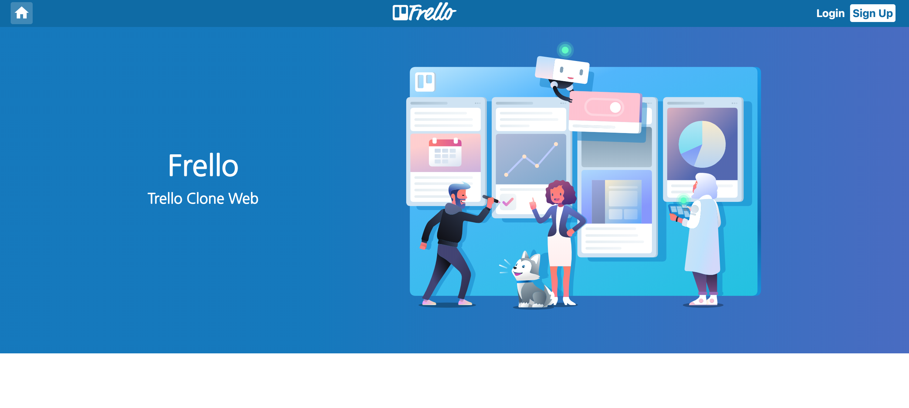
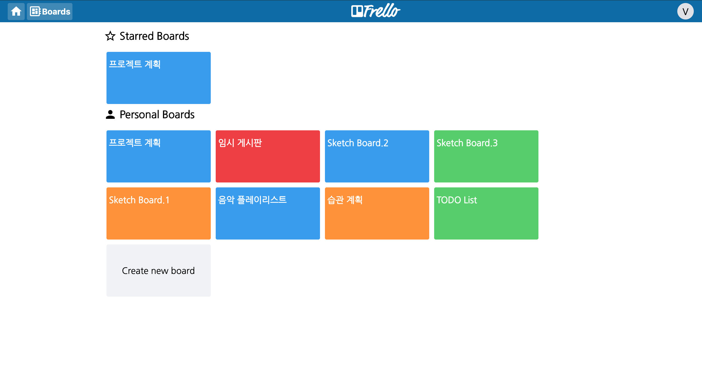
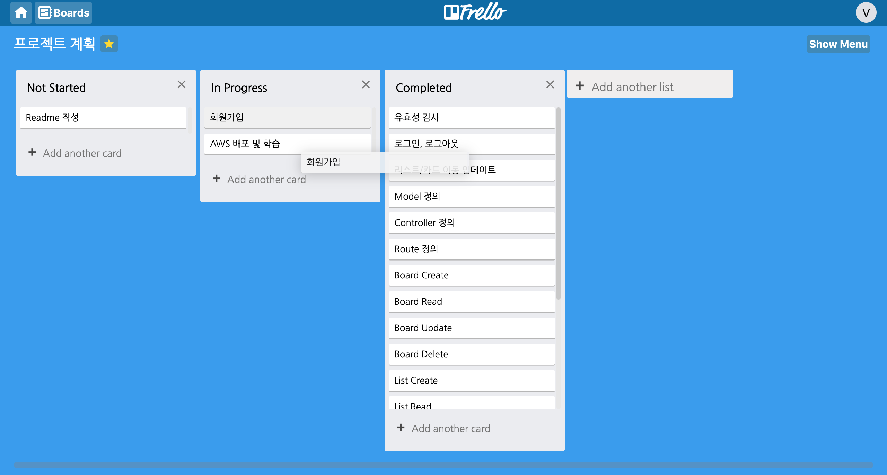
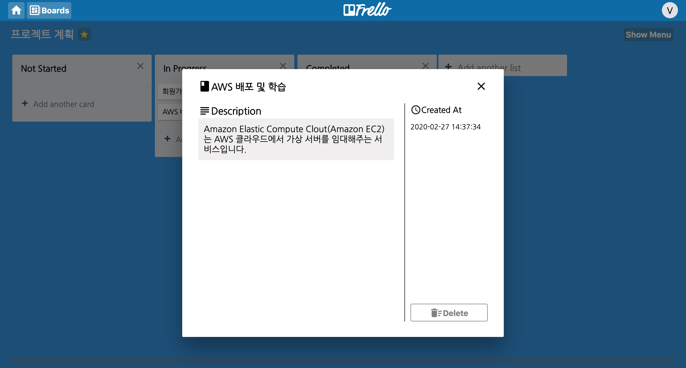
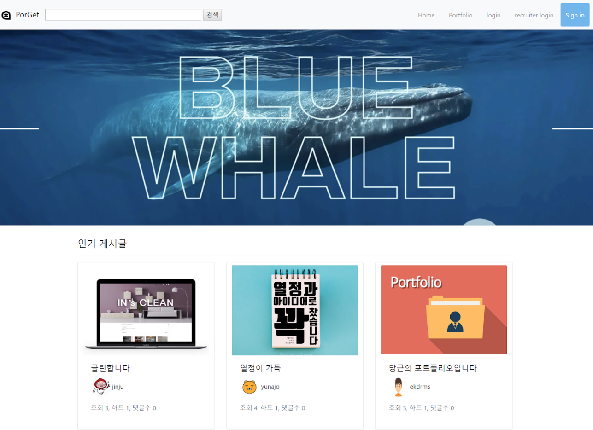
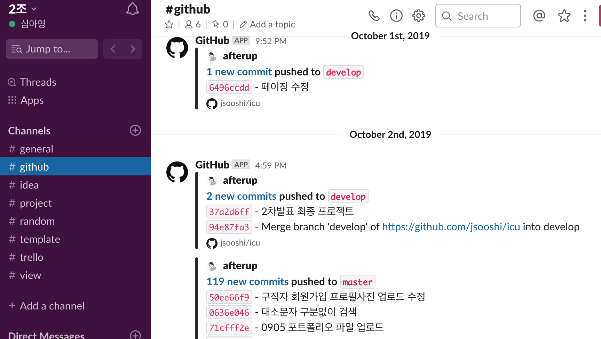

# PORTFOLIO
심아영의 포트폴리오입니다.  
각 섹션의 끝에 소스코드가 링크되어 있습니다.
- [Frello](#Frello)
- [Porget](#Porget)

# Frello

  

웹기반 프로젝트 관리 소프트웨어인 트렐로를 클론한 사이트입니다.  
Link: http://frello.site/   
TestID: vip@gmail.com  
TestPW: vip123

## Built with
 Vue.js, Vuex, axios, Sass, drag & drop api, Node.js, Express.js,   
 MySQL, Sequelize, JWT, Passport.js, bcrypt, REST api, AWS

## Keyword
**Client**
- Axios로 백엔드와 REST API 통신
- Drag & Drop api를 사용하여 엘리먼트의 움직임에 따른 데이터 전송 및 저장 구현
- Vuex를 사용한 상태관리  

**Api**
- JWT와 Passport.js로 사용자 인증 및 회원가입, 로그인 기능 구현
- Sequelize를 사용하여 관계형 데이터베이스 관계 매핑
- REST API를 구축하여 프론트와 백엔드 연결
- AWS EC2, Route 53, Elastic IP를 활용하여 웹 배포

## Sourcecode
- [**Client**](https://github.com/afterup/Frello_client)  
- [**Api**](https://github.com/afterup/Frello_api)

# Porget

개발자 포트폴리오 커뮤니티 사이트 입니다.

## Built with
Java, Spring, JSP, BootStrap, Ajax, Oracle, JDBC
## Keyword
- Github 소스트리에서 Brench를 활용한 소스코드 관리
- 트렐로와 깃허브를 연동한 슬랙을 협업 툴로 사용
- BootStrap을 활용하여 웹 레이아웃 설계
- 게시판 CRUD
## Sourcecode
- [Porget](https://github.com/jsooshi/icu)

